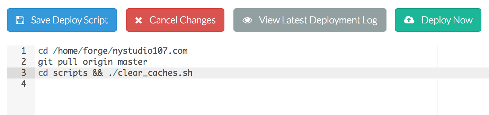

# craft-scripts
Shell scripts to manage permissions, asset syncing, and database syncing between Craft CMS environments

## Overview

There are several scripts included in `craft-scripts`, each of which perform different functions. They all use a shared `.env.sh` to function. This `.env.sh` should be created on each environment where you wish to run the `craft-scripts`, and it should be excluded from your git repo via `.gitignore`.

### set_perms.sh

The `set_perms.sh` script sets the Craft CMS install file permissions in a strict manner, to assist in hardening Craft CMS installs.

See [Hardening Craft CMS Permissions](https://nystudio107.com/blog/hardening-craft-cms-permissions) for a detailed writeup.

### clear_caches.sh

The `clear_caches.sh` script clears the Craft CMS caches by removing all of the `craft/storage/runtime/` cache dirs, as well as emptying the `craft_templatecaches` db table.

If you want to add this to your Forge / DeployBot / Buddy.works deploy script so that caches are auto-cleared on deploy, set up the `.env.sh` on your remote server(s) and then add this to your deploy script:

    cd scripts && ./clear_caches.sh

The above assumes that the current working directory is the project root already.

### pull_db.sh

The `pull_db.sh` script pulls down a database dump from a remote server, and then dumps it into your local database

See [Database & Asset Syncing Between Environments in Craft CMS](https://nystudio107.com/blog/database-asset-syncing-between-environments-in-craft-cms) for a detailed writeup.

### pull_assets.sh

The `pull_assets.sh` script pulls down an arbitrary number of asset directories from a remote server, since we keep client-uploadable assets out of the git repo

See [Database & Asset Syncing Between Environments in Craft CMS](https://nystudio107.com/blog/database-asset-syncing-between-environments-in-craft-cms) for a detailed writeup.

### Setting it up

1. Download or clone the `craft-scripts` git repo
2. Copy the `scripts` directory into the root directory of your Craft CMS project
3. Duplicate the `example.env.sh` file, and rename it to `.env.sh`
4. Add `.env.sh` to your `.gitignore` file
5. Then open up the `.env.sh` file into your favorite editor, and replace `REPLACE_ME` with the appropriate settings.

All configuration is done in the `.env.sh` file, rather than in the scripts themselves. This is is so that the same scripts can be used in multiple environments such as `local` dev, `staging`, and `live` production without modification. Just create a `.env.sh` file in each environment, and keep it out of your git repo via `.gitignore`.

#### Local Settings

All settings that are prefaced with `LOCAL_` refer to the local environment where the script will be run, **not** your `local` dev environment.

`LOCAL_ROOT_PATH` is the absolute path to the root of your local Craft install, with a trailing `/` after it.

`LOCAL_ASSETS_PATH` is the relative path to your local assets directories, with a trailing `/` after it.

`LOCAL_CHOWN_USER` is the user that is the owner of your entire Craft install.

`LOCAL_CHOWN_GROUP` is your webserver's group, usually either `nginx` or `apache`.

`LOCAL_WRITEABLE_DIRS` is a quoted list of directories relative to `LOCAL_ROOT_PATH` that should be writeable by your webserver.

`LOCAL_ASSETS_DIRS` is a quoted list of asset directories relative to `LOCAL_ASSETS_PATH` that you want to pull down from the remote server. It's done this way in case you wish to sync some asset directories, but not others. If you want to pull down all asset directories in `LOCAL_ASSETS_PATH`, just leave one blank quoted string in this array

`LOCAL_DB_NAME` is the name of the local mysql Craft CMS database

`LOCAL_DB_PASSWORD` is the password for the local mysql Craft CMS database

`LOCAL_DB_USER` is the user for the local mysql Craft CMS database

`LOCAL_MYSQL_CMD` is the command for the local mysql executable, normally just `mysql`. It is provided because some setups like MAMP require a full path to a copy of `mysql` inside of the application bundle.

`LOCAL_MYSQLDUMP_CMD` is the command for the local mysqldump executable, normally just `mysqldump`. It is provided because some setups like MAMP require a full path to a copy of `mysqldump` inside of the application bundle.

#### Remote Settings

All settings that are prefaced with `REMOTE_` refer to the remote environment where assets and the database will be pulled from.

`REMOTE_SSH_LOGIN` is your ssh login to the remote server, e.g.: `user@domain.com`

`REMOTE_SSH_PORT` is the port to use for ssh on the remote server. This is normally `22`

`REMOTE_ROOT_PATH` is the absolute path to the root of your Craft install on the remote server, with a trailing `/` after it.

`REMOTE_ASSETS_PATH` is the relative path to the remote assets directories, with a trailing `/` after it.

`REMOTE_DB_HOST` is the host name of the remote mysql Craft CMS database. This is normally `localhost`

`REMOTE_DB_PORT` is the port number of the remote mysql Craft CMS database. This is normally `3306`

`REMOTE_DB_NAME` is the name of the remote mysql Craft CMS database

`REMOTE_DB_PASSWORD` is the password for the remote mysql Craft CMS database

`REMOTE_DB_USER` is the user for the remote mysql Craft CMS database

Brought to you by [nystudio107](https://nystudio107.com/)
